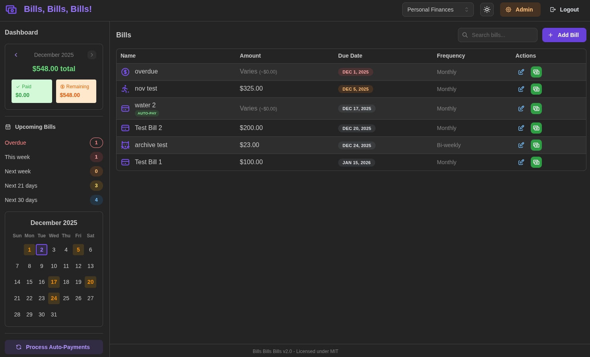

# Bills, Bills, Bills! Expense Tracker

A **secure multi-user** web application for tracking recurring monthly expenses and payments with **complete data separation**. Built with React + Mantine frontend and Flask backend.



## Features

- **Secure Access**: Forced password change for default admin accounts
- **Multi-Database**: Complete data isolation between user groups
- **Modern Dashboard**: Monthly expense tracking with payment history carousel
- **Enhanced Frequencies**: Weekly, bi-weekly, monthly, quarterly, yearly, and custom schedules
- **Flexible Scheduling**: Support for specific dates (1st & 15th), multiple times per week with day picker
- **Payment Logging**: Record payments with automatic bill cycling
- **Payment History**: Full history with edit/delete capabilities, monthly totals carousel for past months
- **Auto-Payments**: Mark bills for automatic payment processing
- **Auto-Migrations**: Automated database updates preserve data during upgrades
- **Admin Controls**: User and database management
- **Custom Icons**: 70+ icons including sports, finance, utilities, entertainment, and more
- **Dark/Light Mode**: Toggle between themes with persistence
- **Responsive**: Works on desktop, tablet, and mobile
- **Calendar View**: Visual calendar showing upcoming bill due dates

## What's New in v2.0

- **React + Mantine UI**: Complete frontend rewrite with modern component library
- **Monthly Payment Carousel**: Navigate through previous months to see payment history
- **Sports Icons**: Added soccer, football, baseball, basketball, tennis, volleyball, golf, trophy
- **Improved Dashboard**: "This Month" section shows all bills due regardless of frequency
- **Payment Tracking**: Past months show only actual recorded payments, not just due dates
- **Dark Mode**: System-aware dark/light theme toggle

## Quick Start

### Prerequisites
- Docker installed and running
- Web browser

### Run the Application

1. **Create a `docker-compose.yml` file** with the following content:

   ```yaml
   version: '3.8'

   services:
     bills-app:
       image: ghcr.io/brdweb/bills-bills-bills:latest
       container_name: bills-bills-bills
       ports:
         - "5000:5000"
       restart: unless-stopped
       volumes:
         # Persistent data storage for all databases
         - ./data:/app/data
         # Mount the shared database directory
         - ./dbs:/app/dbs
   ```

2. **Run the application** (database auto-initializes on first startup):
   ```bash
   docker-compose up -d
   ```

3. **Open your browser** and visit: http://localhost:5000

## First Login

Login with default credentials:
- **Username:** `admin`
- **Password:** `password`

**Security Notice:** You will be **required to change the password** on first login.

## How to Use

### 1. Database Selection
After login, select your database from the dropdown:
- **personal** - Your personal finances (default)

### 2. Add Your First Bill
1. Click the **"Add Bill"** button
2. Enter bill details:
   - Name: "Internet", "Rent", etc.
   - Amount: Fixed amount or check "Varies" for variable costs
   - Frequency: Monthly, Quarterly, or Yearly
   - Due date and optional auto-payment setting
3. Choose an icon from 70+ options across categories

### 3. Record Payments
1. Click **"Pay"** on any bill
2. Enter payment amount
3. Choose to advance due date automatically
4. Payment recorded!

### 4. View Payment History
1. Click on any bill's payment amount
2. View, edit, or delete payment records

### 5. Monthly Overview
- Use the **left/right arrows** in the Dashboard to navigate between months
- Current month shows **Paid** vs **Remaining** breakdown
- Past months show **Total Paid** from actual payment records

## User & Database Management (Admin Only)

### Admin Panel
- **Note:** Only admins can access the Admin Panel
- Click the **"Admin"** button after login

### Database Management
1. Create separate databases for different purposes (family, business, etc.)
2. Grant specific user access to databases
3. Complete data isolation between databases

### User Management
1. Add new users through the Admin Panel
2. Assign admin privileges when needed
3. Control database access permissions

## Application Management

### Start Application
```bash
# Using docker-compose (recommended)
docker-compose up -d

# Or manually
docker start bills-bills-bills
```

### View Logs
```bash
# Using docker-compose
docker-compose logs -f

# Or manually
docker logs -f bills-bills-bills
```

### Stop Application
```bash
# Using docker-compose
docker-compose down

# Or manually
docker stop bills-bills-bills
```

### Update to New Version
```bash
docker pull ghcr.io/brdweb/bills-bills-bills:latest
docker-compose down
docker-compose up -d
```

### Testing Fresh Installation
To test a completely fresh installation (deletes all existing data and reinitializes):
1. Add to your docker-compose.yml under the service:
   ```yaml
   environment:
     - FORCE_FRESH_INIT=true
   ```
2. Run `docker-compose up -d`
3. Remove the environment variable after testing to prevent accidental data loss.

**Warning:** This will delete all existing databases and data! Use only for testing.

### Data Persistence
Docker Compose automatically creates persistent data directories:
- **`data/`** - User accounts, permissions, and system settings (auto-created)
- **`dbs/`** - Individual user databases (one per database you create, auto-created)
- **Your data is automatically preserved between deployments!**

## Security Features

- **Forced Password Change**: Default admin credentials require immediate password update
- **Data Isolation**: Complete separation between different user databases
- **Secure Authentication**: Session-based authentication with automatic timeouts
- **Input Validation**: All user inputs are properly sanitized
- **Admin Controls**: Granular permissions and access control

## Troubleshooting

### Can't Access Admin Panel?
- Ensure you're logged in as an admin user
- Check that the Admin button appears after login

### Login Problems?
- Verify default credentials: `admin` / `password`
- If admin login succeeds, you may need to change the password first

### Data Loss?
- Check that volume mounts are working properly
- Ensure `data/` and `dbs/` directories exist and are writable

### Database Errors?
- Restart the application (`docker-compose restart`)
- Check logs: `docker-compose logs -f`
- Contact support if persistent issues occur

## Support

For technical issues, please check:
1. Application logs (`docker-compose logs -f`)
2. Volume mount configurations (automatically handled by docker-compose)
3. Docker installation and availability

## Technical Details

- **Frontend:** React 19 + Mantine 7 + TypeScript + Vite
- **Backend:** Python Flask with session management
- **Database:** SQLite with database-level isolation
- **Architecture:** Multi-SQLite database system with access control
- **Deployment:** Docker Compose with persistent volumes
- **Icons:** Tabler Icons (70+ categories)

---

**Ready to organize your finances securely? Get started with Bills, Bills, Bills!**
